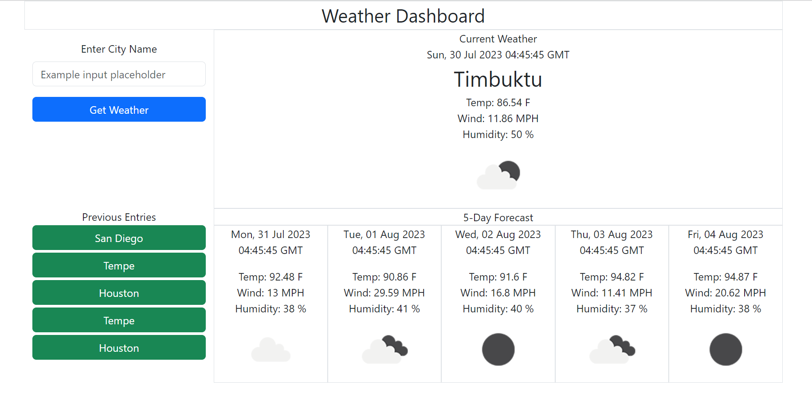
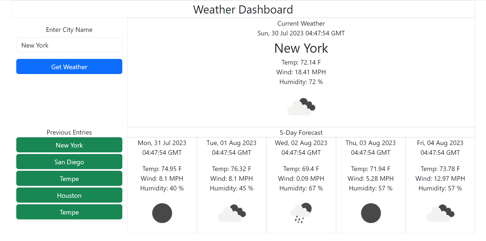
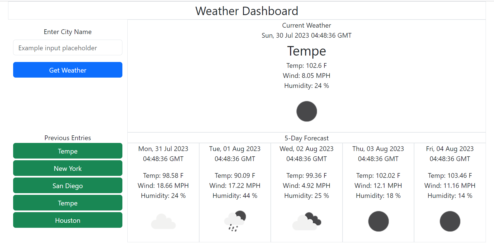

# 06-Weather-Dashboard-Project
This is Rick's weather dashboard project.

# Challenge-06 - Server Side APIs: Weather Dashboard

## Description
The purpose of this project is to build a weather dashboard that will run in the browser and feature dynamically updated HTML And CSS. Acceptance Criteria have been broken down into individual features (e.g. AC01). For details on the implementation, review the applicable 'Usage' section of this README.

### User Story

* AS A traveler
I WANT to see the weather outlook for multiple cities
SO THAT I can plan a trip accordingly

### Acceptance Criteria

> * GIVEN a weather dashboard with form inputs
> * AC01: City Weather Search
>    -	WHEN I search for a city
>    -	THEN I am presented with current and future conditions for that city and that city is added to the search history

>* AC02: Current Weather Display
>    -	WHEN I view current weather conditions for that city
>    -	THEN I am presented with the city name, the date, an icon representation of weather conditions, the temperature, the humidity, and the wind speed

>* AC03: Forecast Display
>    -	WHEN I view future weather conditions for that city
>    -	THEN I am presented with a 5-day forecast that displays the date, an icon representation of weather conditions, the temperature, the wind speed, and the humidity

>* AC04: Search History 
>    -	WHEN I click on a city in the search history
>    -	THEN I am again presented with current and future conditions for that city

## Installation

> * To launch the webpage, open the browser and paste the following URL in the address bar: https://recenasu.github.io/06-Weather-Dashboard-Project/
> * To access the project repo, open the browser and paste the following URL in the address bar: https://github.com/recenasu/06-Weather-Dashboard-Project

## Usage

> * Navigate to the webpage. The webpage displays the current weather and forecast for Timbuktu, by default. Enter a city name in the field provided and click "Get Weather". The current weather and forecast for that city is displayed (AC01) (AC02) (AC03).

> * Enter a different city and click "Get Weather". Note that the search history contains the previous searches. Click on a previous city name to display that city's weather information. (AC04)

The following images show the application sequence.

## Credits

N/A

## License

N/A

## Tests

>1. Open Google Chrome and navigate to https://recenasu.github.io/06-Weather-Dashboard-Project/
>2. Enter the desired city in the Enter City Name field.
>3. Click Get Weather.
>4. Confirm that the current and forecast weather information is displayed.
>5. Click on a city in the search history
>6. Confirm that the current and forecast weather information is displayed.

